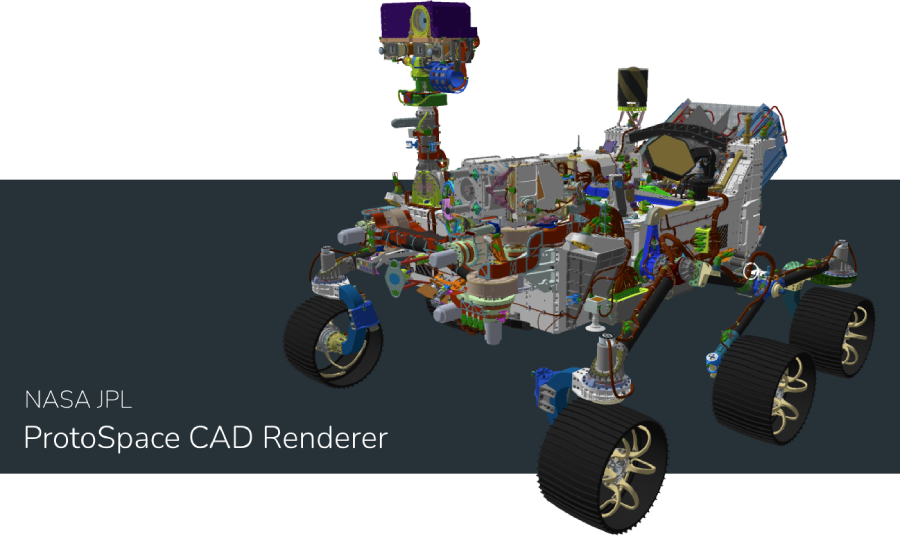

# protospace-cad-renderer

Self-contained code for rendering extremely high-fidelity processed CAD models originally developed for the [NASA JPL ProtoSpace project](https://www.youtube.com/watch?v=dD0FoH8M1EM) web viewer and companion application. Implements techniques for incrementally updating transforms and rendering spacecraft parts, interacting with complex hierarchies of geometries, minimizing visual impact, and compositing layers of rendered components.

Live demo of rendering trimmed down Mars 2020 CAD model [here](https://nasa-jpl.github.io/protospace-cad-renderer/). Note that the page will download multiple hundreds of megabytes of data. Not recommended for mobile data platforms.

_**Warning**: the m2020 model in this repository is over 1.25GB._

## To Run

1. Run `npm install` in the root folder.
1. Run `npm start`.
1. Visit `localhost:8080`.

## Credit

Renderer and interaction implementation credit to Garrett Johnson, Marsette Vona, Charles Goddard, and the ProtoSpace team.

## License

Copyright 2022, by the California Institute of Technology. ALL RIGHTS RESERVED. United States Government Sponsorship acknowledged.

## Dependencies

- [three.js](https://github.com/mrdoob/three.js/), MIT Licensed
- [inflate.js](https://github.com/imaya/zlib.js), MIT Licensed
- [lzf.js](https://github.com/McSimp/lzfjs/), BSD-2-Clause Licensed
